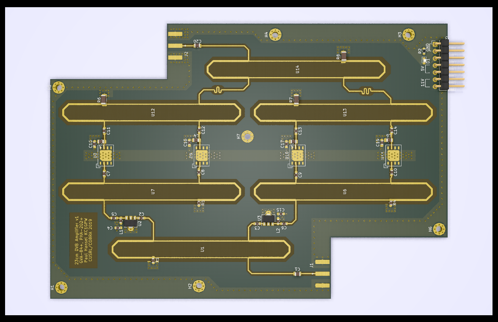

# 23cm DVB amplifier

This amplifier was designed in late 2018 for use as a telemetry/DVB radio for the University of Colorado COBRA/SRL rocket avionics project.

- ~ 4 watts (36 dBm) power output
- ~ 45 dB gain
- 1249 MHz center frequency

Note: editing this project requires at least KiCAD 5.99.

Copyright Paul Hansel (KC1GPW), 2018
